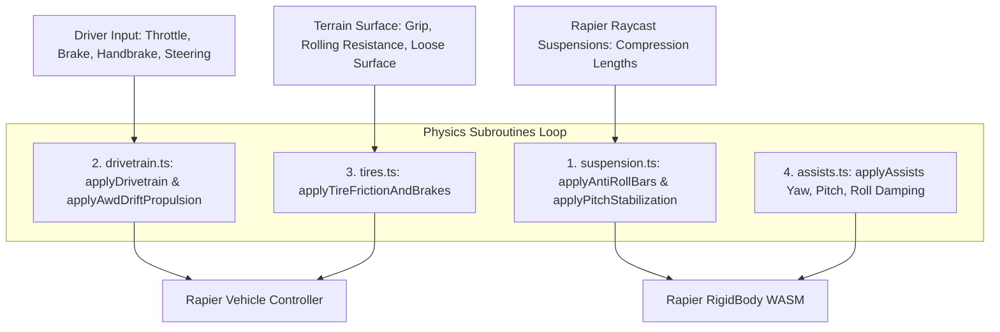

# OpenRally — Driving Model & Physics Tuning Guide for AI

This document provides a comprehensive technical reference for AI agents working on the vehicle driving model, suspension, powertrain, tire friction, and stability assists in OpenRally.

---

## 1. Executive Summary & AI-First Design

To make physics tuning predictable, safe, and effortless for AI agents:
1. **Single Source of Truth**: All global handling balance constants are centralized in [`src/config/physicsBalance.ts`](file:///home/dawid/OpenRally/src/config/physicsBalance.ts) (`DRIVING_MODEL_BALANCE`).
2. **Modular Subroutines**: Physics subroutines in [`src/utils/physics/`](file:///home/dawid/OpenRally/src/utils/physics/) consume `DRIVING_MODEL_BALANCE` without scattered magic numbers.
3. **Fail-Fast Runtime Validation**: [`validateDrivingModelBalance()`](file:///home/dawid/OpenRally/src/utils/validation/physicsBalanceValidator.ts) automatically prevents `NaN`, `Infinity`, or unsafe out-of-bound values from crashing the simulation.
4. **Automated Regression Diagnostics**: [`drivingDynamicsDiagnostics.test.ts`](file:///home/dawid/OpenRally/src/utils/physics/__tests__/drivingDynamicsDiagnostics.test.ts) verifies critical handling scenarios (handbrake under throttle, jump landings, launch ramps, anti-tipping) on every test run.

---

## 2. Physics Execution Pipeline

During each physics tick in [`src/hooks/useVehiclePhysics.ts`](file:///home/dawid/OpenRally/src/hooks/useVehiclePhysics.ts), subroutines execute in the following deterministic sequence:



### Subsystems Breakdown:
1. **Suspension (`suspension.ts`)**:
   - Computes dynamic suspension compression deltas between paired wheels on front and rear axles.
   - Applies Anti-Roll Bar (ARB) impulses to resist chassis body roll during hard cornering.
   - Applies longitudinal pitch stabilization (Anti-Squat under throttle, Anti-Dive under braking).
2. **Drivetrain (`drivetrain.ts`)**:
   - Calculates per-wheel engine drive torque according to gear ratios, rev limiters, and AWD bias.
   - Implements launch torque ramp from 0 km/h to prevent front-axle lift.
   - During handbrake engagement: cuts 100% of rear drive torque and directs tractive power to the front axle.
3. **Tires (`tires.ts`)**:
   - Evaluates Pacejka-lite slip friction curves based on surface material and slip angles.
   - When handbrake is active: guarantees 100% mechanical lockup on rear calipers and allows front steerable wheels to yield slightly to prevent tripping rollovers.
   - Modulates loose surface breakaway during throttle oversteer and high-angle power slides.
4. **Assists (`assists.ts`)**:
   - Turn-in assistance: delivers initial yaw impulse on sharp corner entry from a straight line.
   - Countersteer damping: damps active yaw velocity proportionally to driver countersteer input, decaying smoothly to zero to eliminate snap-oversteer (tank-slappers).
   - Pitch damping: quells nose-dive and suppresses wheelie oscillations on launches.
   - Roll damping: applies dynamic roll velocity damping around the vehicle's local Z axis (boosted during handbrake) to prevent 2-wheel tipping while allowing 360° stunt rolls off ramps.

---

## 3. Centralized Balance Reference (`DRIVING_MODEL_BALANCE`)

All parameters are declared in [`src/config/physicsBalance.ts`](file:///home/dawid/OpenRally/src/config/physicsBalance.ts). Modify these to adjust global behavior across all vehicles.

### 3.1 Handbrake (`DRIVING_MODEL_BALANCE.handbrake`)

| Parameter | Type | Default | Safe Range | Physical Description |
|---|---|---|---|---|
| `minLockupBrakeForce` | `number` | `160.0` | `120.0 – 300.0` | Minimum braking impulse (N·s) applied to rear wheels. Guarantees 100% mechanical lockup. |
| `rearLockupImpulseMultiplier` | `number` | `4.0` | `2.0 – 6.0` | Multiplier for vehicle's base handbrake force for instant lockup on heavy chassis. |
| `frontSteerYieldMultiplier` | `number` | `0.88` | `0.80 – 0.95` | Lateral grip multiplier on front steerable wheels during handbrake. Prevents front tire from acting as a tripping fulcrum. |
| `disableAwdPropulsion` | `boolean` | `true` | `true` | When true, disables artificial body thrust during handbrake so throttle does not fight slide pivots. |
| `rollDampingBoost` | `number` | `2.2` | `1.5 – 3.0` | Roll velocity damping multiplier around local Z axis when handbrake is engaged. Prevents two-wheel tipping. |
| `maxYawRateCeiling` | `number` | `2.4` | `2.0 – 3.2` | Max yaw velocity (rad/s ≈ 137°/s) during handbrake slide before progressive damping engages. |
| `yawExcessDampingGain` | `number` | `1.5` | `0.8 – 2.5` | Damping gain applied to excess yaw velocity above `maxYawRateCeiling`. |

### 3.2 Suspension (`DRIVING_MODEL_BALANCE.suspension`)

| Parameter | Type | Default | Safe Range | Physical Description |
|---|---|---|---|---|
| `antiRollBarMassScale` | `number` | `0.25` | `0.15 – 0.40` | Mass scalar for Anti-Roll Bar force. Pushes compressed wheel UP and lifted wheel DOWN. |
| `antiSquatMassScale` | `number` | `0.28` | `0.18 – 0.45` | Mass scalar for anti-squat / anti-dive longitudinal pitch torque. |
| `pitchDampingMassScale` | `number` | `6.5` | `4.5 – 9.0` | Damping opposing dynamic pitch velocity. Absorbs jump landings and crest cresting. |
| `maxRestoringPitchTorqueG` | `number` | `3.8` | `2.5 – 5.5` | Restoring pitch torque saturation limit in Gs of vehicle mass. Prevents berm jerking. |
| `antiWheeliePitchMultiplier` | `number` | `5.0` | `3.0 – 8.0` | Pitch torque gain planting front axle when front suspension becomes unweighted. |

### 3.3 Drivetrain (`DRIVING_MODEL_BALANCE.drivetrain`)

| Parameter | Type | Default | Safe Range | Physical Description |
|---|---|---|---|---|
| `launchRampEndSpeedMps` | `number` | `3.5` | `2.0 – 5.0` | Speed (m/s) up to which launch torque is ramped from dead stop (simulates clutch/spool). |
| `launchRampBaseFraction` | `number` | `0.72` | `0.55 – 0.85` | Initial torque fraction at 0 m/s standing start (ramps to 1.0 at `launchRampEndSpeedMps`). |
| `gear2TorquePunch` | `number` | `1.08` | `1.00 – 1.20` | Mid-range torque multiplier in 2nd gear (30–80 km/h) for snappy corner exits. |
| `driftBoostSteerWeight` | `number` | `0.35` | `0.20 – 0.50` | AWD tractive power factor per unit of steering angle to overcome lateral tire scrub. |
| `driftBoostSlipWeight` | `number` | `0.75` | `0.40 – 1.10` | AWD tractive power factor per unit of drift slip angle. |
| `frontUnweightedDampingThreshold` | `number` | `0.03` | `0.02 – 0.06` | Front suspension compression below which rear torque is softened (active center differential). |

### 3.4 Assists (`DRIVING_MODEL_BALANCE.assists`)

| Parameter | Type | Default | Safe Range | Physical Description |
|---|---|---|---|---|
| `turnInTorqueGain` | `number` | `0.22` | `0.12 – 0.35` | Progressive turn-in torque assisting initial sharp corner entry from straight line. |
| `countersteerDampingBase` | `number` | `0.60` | `0.40 – 0.85` | Damping opposing active slide yaw velocity when countersteering. Decays smoothly to zero. |
| `rollDampingNormal` | `number` | `0.8` | `0.5 – 1.4` | Baseline roll velocity damping during normal driving. Quells chassis wobble. |
| `steerAssistDeadzone` | `number` | `0.02` | `0.01 – 0.05` | Steering deadzone below which steering assist is considered neutral. |
| `pitchDampingThrottleUp` | `number` | `4.2` | `3.0 – 6.0` | Pitch velocity damping when accelerating with front end lifting. |
| `pitchDampingNormal` | `number` | `2.4` | `1.5 – 3.5` | Baseline pitch velocity damping under braking or steady state. |

### 3.5 Tires (`DRIVING_MODEL_BALANCE.tires`)

| Parameter | Type | Default | Safe Range | Physical Description |
|---|---|---|---|---|
| `minPowerSlideSlipAngle` | `number` | `0.25` | `0.18 – 0.32` | Minimum slip angle (rad ≈ 14.3°) before power-slide wheelspin relaxation engages. |
| `wheelspinFrictionDropFront` | `number` | `0.03` | `0.01 – 0.06` | Friction reduction on front wheels during high-angle power-slide wheelspin. |
| `wheelspinFrictionDropRear` | `number` | `0.08` | `0.04 – 0.14` | Friction reduction on rear wheels during high-angle power-slide wheelspin. |
| `looseSurfaceFrontWeight` | `number` | `0.50` | `0.35 – 0.65` | Weight of surface traction loss on front steerable wheels under throttle. |
| `looseSurfaceRearWeight` | `number` | `0.75` | `0.60 – 0.90` | Weight of surface traction loss on rear driven wheels under throttle. |

### 3.6 Per-Vehicle Balance Overrides (`balanceOverrides`)

Global defaults in `DRIVING_MODEL_BALANCE` apply to all vehicles. However, when tuning specific vehicle archetypes (e.g. heavy raid trucks like `kodiakRaid` or agile supercars like `vanguardGT`), you can specify deep partial overrides directly on the vehicle's `VehicleConfig`:

```typescript
// Example: vehicle preset config
export const kodiakRaidConfig: VehicleConfig = {
  // ...base vehicle parameters...
  balanceOverrides: {
    suspension: {
      antiRollBarMassScale: 0.35, // Stiffer anti-roll resistance for heavy chassis
      pitchDampingMassScale: 8.0, // Extra pitch damping for long-travel raid suspension
    },
    handbrake: {
      minLockupBrakeForce: 240.0, // High-torque lockup for oversized all-terrain tires
    },
  },
};
```

The runtime resolves the active balance using [`resolveVehicleBalance(config)`](file:///home/dawid/OpenRally/src/config/physicsBalance.ts), which validates the merged configuration against schema guardrails and caches the result with zero per-frame allocation overhead.

---

## 4. AI Tooling Suite & Helpers

OpenRally provides dedicated developer tools designed specifically for AI agents to make physics tuning, vehicle creation, and regression detection completely automated and error-free:

### 4.1 Physical Suspension & Damping Formulas ([`tuningHelpers.ts`](file:///home/dawid/OpenRally/src/utils/physics/tuningHelpers.ts))

Never guess suspension stiffness or damping numbers. Use mathematically calibrated engineering formulas:
- `calculateCornerMasses(chassisMass, options)`: Computes front and rear corner masses based on weight distribution.
- `calculateCriticalDamping(stiffness, cornerMass)`: Calculates Rapier-calibrated critical damping $c_{\text{crit}} = 2\sqrt{k \times (m_{\text{corner}} / 37.5)}$.
- `calculateDamping(stiffness, cornerMass, dampingRatio)`: Computes optimal damping for desired ratio $\zeta$ (0.65–0.85 for rally, 0.70–0.90 for track).
- `calculateNaturalFrequencyHz(stiffness, cornerMass)`: Evaluates natural bounce frequency in Hertz (1.2–2.4 Hz).
- `tuneSuspensionForMass(wheels, chassisMass, options)`: Scales an existing 4-wheel suspension setup to a new vehicle mass while preserving optimal natural frequencies and damping ratios.
- `tuneBrakesForMass(brakes, chassisMass)`: Scales service brakes and handbrake locking torque proportionally with chassis weight.
- `applyHandlingProfile(config, profile)`: Applies calibrated handling archetypes (`rally_gravel`, `track_asphalt`, `offroad_raid`, `drift_spec`).

### 4.2 Automated Handling Diagnostics Auditor ([`vehicleDiagnostics.ts`](file:///home/dawid/OpenRally/src/utils/physics/vehicleDiagnostics.ts))

Run an automated static and dynamic audit on any vehicle configuration:

```typescript
import { diagnoseVehicleHandling } from '@/utils/physics/vehicleDiagnostics';

const report = diagnoseVehicleHandling(vehicleConfig);
if (report.status === 'critical') {
  for (const finding of report.findings) {
    console.warn(`[${finding.code}] ${finding.message}`);
    console.log(`Fix: Set ${finding.parameterPath} to ${finding.suggestedValue}`);
  }
}
```

The diagnostic auditor inspects:
- Front/rear natural frequency spread (prevents chassis hobby-horsing)
- Critical damping ratios (flags bouncy or sluggish suspension)
- Anti-Roll Bar balance ratios (flags snap-oversteer or extreme understeer)
- Handbrake locking torque capacity vs. mass
- Center of mass height vs. track width (rollover propensity)

### 4.3 Headless Simulator & Maneuver Benchmark Suite ([`headlessSimulator.ts`](file:///home/dawid/OpenRally/src/utils/physics/testing/headlessSimulator.ts))

Run standardized vehicle maneuvers without mounting WebGL or React:

```typescript
import { runFullVehicleBenchmark } from '@/utils/physics/testing/headlessSimulator';

const scorecard = runFullVehicleBenchmark(vehicleConfig);
console.log(scorecard.passedAllSafetyGates); // true / false
console.log(`0-100 km/h: ${scorecard.acceleration.timeTo100Kmh.toFixed(2)}s`);
console.log(`100-0 km/h: ${scorecard.braking.brakingDistanceM.toFixed(1)}m`);
console.log(`Slalom max roll: ${scorecard.slalom.maxRollAngleDeg.toFixed(1)}°`);
```

Standardized tests include:
1. `runAccelerationBenchmark`: 0–100 km/h time, traction stability, launch wheelie pitch.
2. `runBrakingBenchmark`: 100–0 km/h stopping distance, anti-dive pitch control.
3. `runSlalomBenchmark`: 75 km/h high-speed sine slalom, body roll angle, 2-wheel tipping check.
4. `runHandbrakeFlickBenchmark`: 80 km/h handbrake turn, rear wheel lockup verification, yaw rate ceiling.

### 4.4 Modular Physics Pipeline Architecture ([`vehiclePipeline.ts`](file:///home/dawid/OpenRally/src/utils/physics/vehiclePipeline.ts))

The physics execution tick in [`src/hooks/useVehiclePhysics.ts`](file:///home/dawid/OpenRally/src/hooks/useVehiclePhysics.ts) is decomposed into zero-allocation, independently testable pure subroutines:
- `calculateGroundContact`: Evaluates contact status, average normals, and wheel contact counts.
- `updateRolloverDetection`: Tracks rollover thresholds with smooth time window confirmation.
- `calculateRollingResistanceImpulse`: Evaluates rolling resistance forces based on surface properties.
- `populateTelemetryState`: Feeds HUD and telemetry stores without allocating objects.

---

## 5. Issue-to-Parameter Troubleshooting & Tuning Matrix

When users or test logs describe a handling flaw, use this matrix to quickly pinpoint and adjust the appropriate balance parameter:

| User / Telemetry Symptom | Root Cause | Target Balance Parameter | Recommended Adjustment |
|---|---|---|---|
| **"Car tips onto two wheels / flips when pulling handbrake and steering"** | Front outside tire has excessive lateral grip acting as a tripping fulcrum, or roll oscillations are unsuppressed. | `handbrake.frontSteerYieldMultiplier`<br>`handbrake.rollDampingBoost`<br>`suspension.antiRollBarMassScale` | Lower `frontSteerYieldMultiplier` (e.g. `0.85`), increase `rollDampingBoost` (e.g. `2.5`), or increase `antiRollBarMassScale` (e.g. `0.30`). |
| **"Car bounces like a basketball on jump landing"** | Suspension pitch damping is too weak or vehicle spring damping is underdamped. | `suspension.pitchDampingMassScale`<br>`vehicle.suspension.damping` | Increase `pitchDampingMassScale` (e.g. `7.5 – 8.5`) or adjust individual vehicle `suspension.damping`. |
| **"Handbrake doesn't lock rear wheels when pressing throttle"** | Rear drivetrain torque is overpowering rear brake calipers, or forward body thrust is active. | `handbrake.disableAwdPropulsion`<br>`handbrake.minLockupBrakeForce`<br>`handbrake.rearLockupImpulseMultiplier` | Ensure `disableAwdPropulsion: true`, increase `minLockupBrakeForce` (e.g. `180 – 220`), or increase `rearLockupImpulseMultiplier`. |
| **"Front wheels lift off the ground / car wheelies on launch"** | Standing start torque is applied too abruptly before vehicle develops forward momentum. | `drivetrain.launchRampBaseFraction`<br>`drivetrain.launchRampEndSpeedMps`<br>`assists.pitchDampingThrottleUp` | Lower `launchRampBaseFraction` (e.g. `0.65`), increase `launchRampEndSpeedMps` (e.g. `4.0`), increase `pitchDampingThrottleUp`. |
| **"Violent tank-slapper bounce / rebound when countersteering out of a slide"** | Countersteer yaw assist was applying additive torque rather than pure damping. | `assists.countersteerDampingBase` | Increase `countersteerDampingBase` (e.g. `0.65 – 0.75`). |
| **"Vehicle spins out uncontrollably like a centrifuge during handbrake"** | Yaw angular velocity is unbounded during handbrake slides. | `handbrake.maxYawRateCeiling`<br>`handbrake.yawExcessDampingGain` | Decrease `maxYawRateCeiling` (e.g. `2.2 rad/s`), increase `yawExcessDampingGain` (e.g. `1.8`). |
| **"Car feels too stiff / understeers heavily on corner entry"** | Turn-in assist torque is too low or front tire grip peak is too narrow. | `assists.turnInTorqueGain`<br>`tires.looseSurfaceFrontWeight` | Increase `turnInTorqueGain` (e.g. `0.26 – 0.30`). |
| **"Car loses all speed during power slides and stalls out"** | Tire lateral friction scrub is too high or drift power boost is too weak. | `drivetrain.driftBoostSlipWeight`<br>`tires.wheelspinFrictionDropRear` | Increase `driftBoostSlipWeight` (e.g. `0.85 – 0.95`), increase `wheelspinFrictionDropRear` (e.g. `0.10`). |

---

## 6. Non-Negotiable AI Invariants

1. **Zero Allocations in Hot Loops**: In `useFrame`, `applyDrivetrain`, `applyTireFrictionAndBrakes`, `applyAntiRollBars`, and `applyAssists`, **never instantiate objects, arrays, closures, or Three.js vectors**. Always re-use module-scoped scratch instances (`_scratchVec`, `_bodyQuat`, etc.).
2. **Defensive Numerical Guards**: All calculated forces, torques, and impulses must pass `Number.isFinite()`. Never apply `NaN` or `Infinity` to Rapier.
3. **Slope & Gravity Invariance**: Roll and pitch damping must operate strictly on **angular velocity (`angvel`)**, NEVER on world-space angles against gravity. Angular velocity damping decays to zero when the car is stationary on a slope or climbing steep hills/dunes.
4. **Mandatory Verification**: Always execute `npm run check` (`tsc --noEmit` + `oxlint` + `vitest run`) after making any modifications to the driving model. All tests must pass with zero warnings and zero errors.
